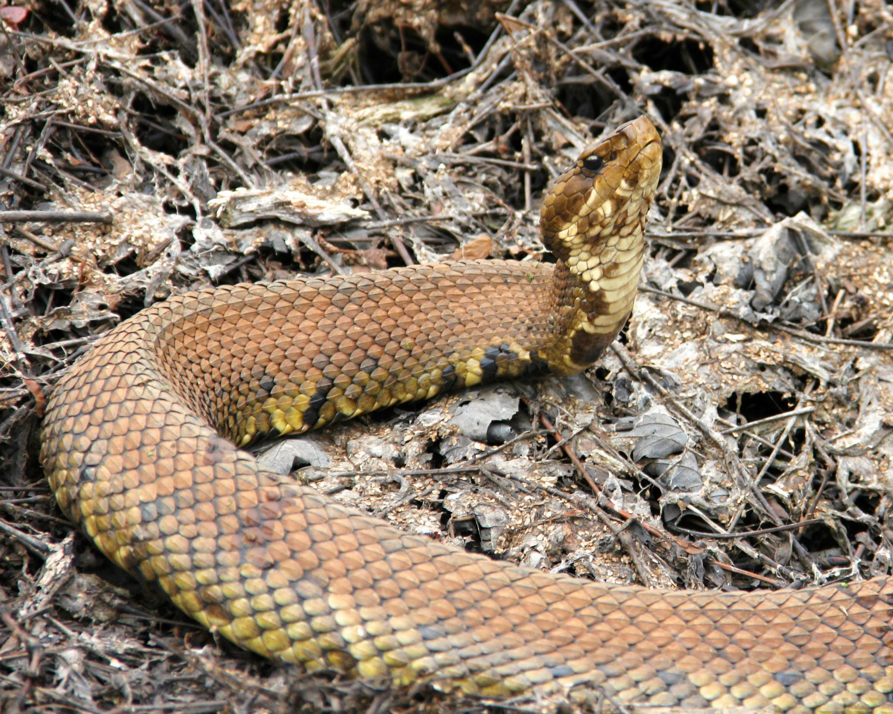
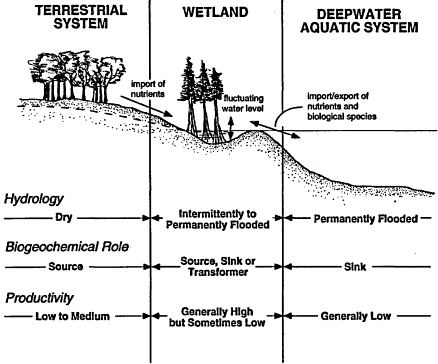
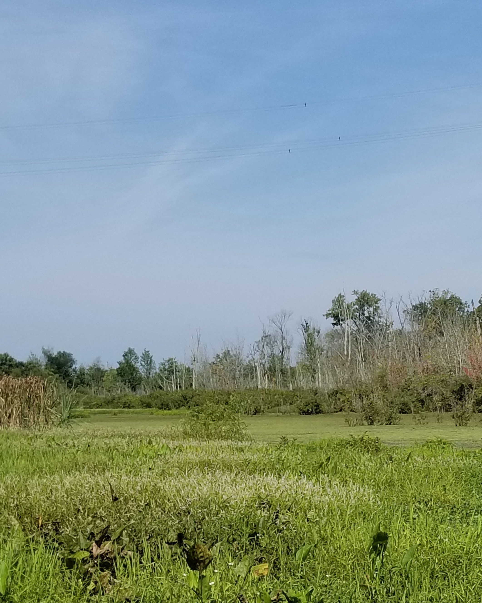

<center>{width=70%}</center>


```{r Library, include=FALSE}
packages<-c("adehabitatHR","ggmap","dismo","rgbif","rdryad","utils","readxl","ggridges","viridis","rasterVis","maps","mapdata","raster",
"rasterImage", "data.table","ggfortify","grid","move","moveVis","OpenStreetMap","pbapply","plotly",
"rgdal","sp","tidyverse", "dplyr", "ggplot2", "factoextra", "FactoMineR", "tidyr", "knitr", "gridExtra", "lattice", "permute", "vegan", "RVAideMemoire", "MASS", "caret", "tmap", "tmaptools", "ggsn", "leaflet", "sf", "sp", "ggmap", "randomForest", "randomForestExplainer", "rfUtilities", "faraway", "ROCR", "formattable", "kableExtra", "cowplot", "ggforce", "ggrepel", "ggExtra", "gt", "glue", "Boruta", "pdp", "ggpubr", "scales", "rinat")
sapply(packages, require, character.only=T)
```

# **Abstract**

1.Wetlands are typically transitional habitats that represent a dynamic hydrologic gradient between terrestrial and aquatic systems. As hydrologic fluctuations within a wetland can cause the habitat to become periodically unsuitable and resource-limited, species with traits that can adapt to these environmental changes will be favored. Populations inhabiting highly dynamic environments with high frequencies of disturbance may have extensive niche overlap and less habitat specialization among residents. This study examined the habitat selection of cottonmouths inhabiting an isolated riverine slough along the Cumberland River (Middle Tennessee). We hypothesize that cottonmouths (Agkistrodon piscivorus) use generalist habitat selection as an adaptation to hydrologically-dynamic ecosystems, and have extensive habitat niche overlap as a result of temporal instability of habitat resources.

2.Field collection was by visual-encounter surveys and environmental (abiotic and biotic) variables were recorded for each observed snake location (N = 149) and paired with a random location to assess available habitats and microhabitats within the study area. 

3.Multivariate analysis found that the cottonmouths have a broad preference for a variety of microhabitats within the riverine slough. In addition, we found no intra-specific differences in habitat use between adult males and females. However, there was an ontogenetic shift with younger individuals selecting more terrestrial habitats with appropriate cover objects. 

4.Random Forest modeling determined that cottonmouths tended to select sites associated near or within water, even though fully terrestrial habitats were available, emphasizing cottonmouths preference for wetland ecosystems.

5.Our findings suggest that the stochastic hydrologic regime of the study area has promoted cottonmouths to exhibit a generalist habitat strategy to increase the opportunity to obtain resources in an unstable environment.


# **Introduction**

Wetlands are productive and biologically diverse systems that provide resources for a variety of wildlife species during part or all of their life stages (Mitsch & Gosselink, 2000). Wetlands are often viewed as transitional ecosystems connecting terrestrial and aquatic systems, where fluctuations in hydrology can influence wetland boundaries to encroach or recede from the upland habitats (Brinson, 1993). These wet-dry hydrologic fluctuations can cause habitat to become periodically unsuitable and resource-limited, as areas can become either flooded or dry completely (Brinson, 1993). Fluctuations are typically both seasonal and stochastic and can cause some species to use wetland areas only when favorable conditions are available (i.e. specialists), or adopt more general use as the hydrological environmental changes (i.e. generalists) (Devictor, Julliard & Jiguet, 2008; Poff & Zimmerman, 2010). As geomorphology shapes catchment area and water level retention in wetland systems, different wetland types have varying hydroperiods which range from stable seasonal-depressional wetlands (Winter & Rosenberry, 1998; Mitsch & Gosselink, 2000) to highly variable riverine-floodplains (Junk, Bayley & Sparks, 1989). These differing wetland associations may conditionally favor certain strategies of habitat use, specifically, habitats with heterogeneous environments and frequent disturbance regimes are typically colonized successfully by generalist species (Macarthur & Wilson, 1967; Adler & Wilson, 1987; Fournier et al., 2015; Büchi & Vuilleumier, 2016).  



As environmental factors largely shape life history strategies at the broader scale, resource availability and competition may play a role in determining habitat use at smaller scales (Mayor et al., 2009), where competitive exclusion forces organisms to alter their strategy of resource exploitation and become either highly specialized or adapt broad use of diets and habitats (Greenbaum, 2004; Steen et al., 2014). As interspecific competition shapes evolutionary strategies of resource use between species (Levin, 1970), so too does intraspecific competition (Amarasekare, 2003). Intraspecific competition is thought to be more prevalent within species, and to avoid the limiting effects, inferior competitors tend to select resources not exploited by the superior (Bolnick, 2004).

A semi-aquatic species that is commonly found in a variety of wetland habitats throughout the southeastern United States is the cottonmouth (Agkistrodon piscivorus). Cottonmouths are dietary generalists, consuming anurans, fish, invertebrates, lizards, snakes, turtles, carrion, and smaller conspecifics (Gloyd & Conant, 1990; McKnight et al., 2014). Cottonmouths are considered “habitat generalists” (Gloyd & Conant, 1990; Enst & Ernst, 2011), as they are found in many different aquatic-associated habitats, including high elevation streams (Hill & Beaupre, 2008), depressional wetlands (Eskew, Willson & Winne, 2009; Delisle et al., 2019a), and river floodplains (Ford, Brischoux & Lancaster, 2004; Roth, 2005). 

Cottonmouths are often in high abundance within appropriate habitats (Ford, 2002), and can have subtle ontogenetic differences in habitat selection (Eskew et al., 2009) and seasonal habitat differences between sexes (Delisle et al., 2019b a). Ontogenetic shifts in habitat selection and diet are thought to be a common competitive exclusion strategy in reptiles (Vitt, 2000; Shine, Shine & Shine, 2003), and differences in habitat use between sexes in pit-vipers is relatively common (Reinert, 1984; Pearson, Shine & How, 2002). However, populations inhabiting highly dynamic environments with high incidence of disturbance may promote niche overlap and reduce habitat specialization among residents (Marvier, Kareiva & Neubert, 2004; Mason et al., 2011; Durso, Willson & Winne, 2013; Smith et al., 2018; Stireman & Singer, 2018). As cottonmouth populations occupy a variety of wetland habitats, populations inhabiting heterogeneous environments with frequent disturbance regimes should be driven predominantly by local environmental fluctuations rather than by population interactions (Mason et al., 2011; Stireman & Singer, 2018).

In this study, we sought to understand the habitat niche space and selection strategy of an isolated population of cottonmouths found within a hydrologically-dynamic riverine wetland slough. We hypothesize that cottonmouths use generalist habitat selection as an adaptation to hydrologically-dynamic ecosystems, and have extensive habitat niche overlap due to the temporal instability of habitat resources. To examine cottonmouth habitat niche space and habitat selection strategy, we (i) investigated the realized niche space from comparisons of the available habitat in the context of the transitional wetland gradient from aquatic to terrestrial zones, (ii) determined whether there was a presence of intraspecific differences in habitat use among conspecifics within the hydrologically dynamic environment, and (iii) determined which environmental factors promoted (were most predictive of) the occurrence of cottonmouths within our study area to further investigate their habitat selection strategies. 


# **Background**

The species *A. piscivorus* are located throughout the southeast United States, and are predominenty found near wetland habitats, such as marshes, riverine sloughs, and swamps (Parkinson et al. 2000, Porras et al. 2013). 

```{r Cottonmouth Data, fig.width = 8, fig.height = 8, message=FALSE, warning=FALSE, cache = TRUE}
extent <- extent(-94,-78,25,40)

# DISMO and GBIF
#Below, code of locations from the gbif database.

agk_dismo <- gbif("agkistrodon", species = "piscivorus", ext = extent, geo = TRUE, sp = TRUE, download = TRUE, removeZeros = TRUE)

#agk_dismo <- get_inat_obs(query = "Agkistrodon piscivorus")
# Code above, if wanting to use iNaturalist's database
agk_xy <- as.data.frame(cbind(agk_dismo@coords[,1],agk_dismo@coords[,2]))

#agk_xy<- as.data.frame(cbind(agk_dismo$longitude, agk_dismo$latitude))
colnames(agk_xy) <- c("longitude","latitude")

agk_xy<-cbind(agk_xy, data.frame("Species" = "Cottonmouth"))

us <- map_data("state")

#Outmap
state <- map_data("state")
county <- map_data("county")
study_site <- data.frame("x" = -87.092447, "y" = 36.288684)
tn <- county %>% 
  filter(region=="tennessee")

Cheatham <- county %>% 
  filter(region=="tennessee") %>% 
  filter(subregion=="cheatham")

#Creating Distribution Map

ggplot(data = agk_xy, aes(x=longitude, y=latitude)) +
  geom_polygon(data = us, aes(x=long, y = lat, group = group), fill = "dark green", color="black") +
  geom_polygon(data = tn, aes(x=long, y = lat, group = group), fill = "dark green", color = "black") + 
  stat_density2d(aes(fill = stat(level)), alpha= .25, geom = "polygon", data = agk_xy, n = 40)+
  scale_fill_gradient(low="yellow", high = "red")+
  geom_point(aes(x=longitude, y=latitude), color = "red") +
  geom_polygon(data = Cheatham, aes(x=long, y = lat, group = group), shape = 5,fill = "Dark Blue", color="black") + 
  xlab("Longitude") + 
  ylab("Latitude") +
  coord_fixed(xlim = c(-94,-77), ylim = c(25,40))+
  theme(panel.background = element_rect(fill = "lightblue"))+
  theme(legend.position=c(0.95, 0.88), legend.background = element_rect(fill="White",
      size=0.5, linetype="solid", colour ="black"))+
  ggtitle("Cottonmouth Species Distribution Map")+
  theme(plot.title = element_text(hjust = 0.5))
```

**Map 1:** The distribution of cottonmouth (*A. piscivorus*) throughouth the continental United States based on museum specimens from the GBIF database (https://www.gbif.org/). The study area was conducted in Cheatham County, TN, which is highlighted in dark blue. 

# **Methods**
```{r Dataset}
study<-read.csv("data/Cottonmouth-Datasheet.csv")
```
## Study site

Data were collected along the Cumberland River Bicentennial Trail (CRBT), Cheatham County, Tennessee, USA (36˚17’ N, 87˚05’W). The site is a mixture of lowland forest, slough wetlands, upland limestone bluffs, and rocky outcrops. Cottonmouths use the upland forest and limestone bluffs as overwintering sites and occupy the lowland forest slough during the active season. The site is bordered by limestone bluffs and backwater streams along the northern portions, the Cumberland River along the west and south, and crop fields and urban development along the southern portions. These landscape features appear to largely isolate the population from dispersal and unpublished telemetry data (Smith, 2009; Fulbright, 2014) noted that snakes did not leave the approximately 76 hectare study area.  

```{r Interactive Ploty Map,  message=FALSE, warning=FALSE, cache = TRUE}
#Setting Up Coordinates
coord<-cbind(study$UTM_mE, study$UTM_mN)
coord_locations<-SpatialPoints(coord,
                               proj4string = CRS("+proj=utm +zone=16 +datum=WGS84"))
lat.lon<- as.data.frame(spTransform(
  coord_locations, CRS("+proj=longlat +datum=WGS84")))
colnames(lat.lon)<-c("x","y")

study<-cbind(study,lat.lon)

#Subsets of Dataset

habitat<- study %>% subset(Type == "GENERAL")
snake<- study %>% subset(Type == "SNAKE")

#Raster from OSM

raster <- openmap(c(max(lat.lon$y)+0.01, min(lat.lon$x)-0.01), 
                  c(min(lat.lon$y)-0.01, max(lat.lon$x)+0.01), 
                  type = "bing")

raster_utm <- openproj(raster, 
              projection = "+proj=longlat +datum=WGS84")

autoplot(raster_utm, expand = TRUE) + theme_bw() +
  theme(legend.position="bottom") +
  geom_point(data=snake, aes(x,y, shape=Group, color = Group), size = 2.5, alpha = 0.8) +
  scale_shape_manual(values = c(15,16,17,18))+
  coord_fixed(xlim = c(min(habitat$x),max(habitat$x)), ylim = c(min(habitat$y),max(habitat$y)))+
  theme(axis.title = element_text(face="bold")) + labs(x="Longitude",
        y="Latitude")+
  ggtitle("Study Area")+
  theme(plot.title = element_text(hjust = 0.5))
```

**Map 2:** The locations cottonmouths were found within the study area during the active seasons (May - October) of 2012, 2013, & 2019.

The habitat types found within the study area are the buttonbush slough in the central portion (12.6 ha), characterized by relatively open canopy, deeper water (50-150 cm), and mats of floating vegetation (Hydrocotyle ranunculoides & Ludwigia palustris) scattered throughout the slough. An open water habitat (> 100cm) is located toward the western portion of the study area. The seasonally flooded lowland forest (20.9 ha), dominated by red maples (Acer rubrum), has the denser canopy closure for the wetland, and is located between the slough and upland forest. Toward the southern portion between the slough and crop fields is a transitional edge area (15.4 ha) dominated by dense grass vegetation and occasionally floods (<10cm) in some portions throughout the year.  The upland forest habitat (16.3 ha) was dominated by oak trees (Quercus sp.) and had dense canopy closure and higher percentage of bare soil. Three main streams flow into the slough from the upland forest and provide a permanent source of water to the slough, along with periodic flooding from the Cumberland River, and groundwater seepage. A constructed levee divides the slough from adjacent crop fields, and during the fall waterfowl hunt, a culvert is opened from the levee to reduce the flooded areas.

### Hydrology Plots {.tabset}
```{r Hydro Graphs, fig.height=8, fig.width=10}
gauge<-read.csv("data/GaugeData-USGS.csv")
gauge[,2]<-as.Date(gauge[,2])
gauge[,4]<-gauge[,3]*0.3048

p1<-ggplot(gauge, aes(x =gauge$datetime, y= gauge$V4))+
  geom_line(color = "blue")+
  xlab("")+
  ylab("Gauge Height (m)")+
  ggtitle("USGS 03435000 Cumberland River Below Cheatham Dam, TN")+
  theme_classic(base_size = 14)

p1<-p1+scale_x_date(breaks=date_breaks("6 months"), labels = date_format("%b %y"))

discharge<-read.csv("data/SycamoreData-USGS.csv")
discharge[,2]<-as.Date(discharge[,2])
discharge[,4]<-discharge[,3]*0.0283168

p2<-ggplot(discharge, aes(x =discharge$datetime, y= discharge$V4))+
  geom_line(color = "steelblue3")+
  xlab("")+
  ylab("Discharge (cubic meters per second)")+
  ggtitle("USGS 03431800 Sycamore Creek Near Ashland City, TN")+
  theme_classic(base_size = 14)

p2<-p2+scale_x_date(breaks=date_breaks("6 months"), labels = date_format("%b %y"))

hydrogrid<-plot_grid(p1,p2, ncol = 1, align = "v")

#If needing black and white

p1<-ggplot(gauge, aes(x =gauge$datetime, y= gauge$V4))+
  geom_line(color = "black")+
  xlab("")+
  ylab("Gauge Height (m)")+
  ggtitle("USGS 03435000 Cumberland River Below Cheatham Dam, TN")+
  theme_classic(base_size = 14)

p1<-p1+scale_x_date(breaks=date_breaks("6 months"), labels = date_format("%b %y"))

discharge<-read.csv("data/SycamoreData-USGS.csv")
discharge[,2]<-as.Date(discharge[,2])
discharge[,4]<-discharge[,3]*0.0283168

p2<-ggplot(discharge, aes(x =discharge$datetime, y= discharge$V4))+
  geom_line(color = "black")+
  xlab("")+
  ylab("Discharge (cubic meters per second)")+
  ggtitle("USGS 03431800 Sycamore Creek Near Ashland City, TN")+
  theme_classic(base_size = 14)

p2<-p2+scale_x_date(breaks=date_breaks("6 months"), labels = date_format("%b %y"))

hydrogrid1<-plot_grid(p1,p2, ncol = 1, align = "v")
```
#### Colored tab
```{r colored hydrograph, fig.height=8, fig.width=10, message=FALSE, warning=FALSE}
hydrogrid
```

**Figure 1** (above) Hydrographs of the annual hydrology of the Cumberland River below Cheatham Dam, TN recorded at 36°19'22.26" N & 87°13'41.73" W, and Sycamore Creek Near Ashland City, TN (below) recorded at 36°19'11.89" N, & 87°03'04.29"W. Both waterways flow into Cumberland River Bicentennial Trail riverine wetland slough and were recorded within 8 km from the study site. Information was provided by the USGS National Water Information System (https://waterdata.usgs.gov/nwis).

#### Black and White tab
```{r black and white hydrograph, fig.height=8, fig.width=10, message=FALSE, warning=FALSE}
hydrogrid1
```

**Figure 1** (above) Hydrographs of the annual hydrology of the Cumberland River below Cheatham Dam, TN recorded at 36°19'22.26" N & 87°13'41.73" W, and Sycamore Creek Near Ashland City, TN (below) recorded at 36°19'11.89" N, & 87°03'04.29"W. Both waterways flow into Cumberland River Bicentennial Trail riverine wetland slough and were recorded within 8 km from the study site. Information was provided by the USGS National Water Information System (https://waterdata.usgs.gov/nwis).


## Field Collection 

We conducted visual encounter surveys during the active seasons (April – October) and snakes were captured using tongs and retained in plastic restraining tubes (Midwest Tongs, Greenwood, MO, USA). For individual identification, each snake was implanted subcutaneously with a Passive Integrated Transponder (PIT) tag (Biomark, Boise, ID, USA) on the ventral side, posterior to midbody. Tags and implant syringes were soaked in Benzalkonium Chloride (Benz-all; VetPro, Northfield, MN, USA) for 2 – 3 minutes prior to tag implantation, and an antiseptic liquid bandage (Vetclose, Portland, ME, USA) was applied to the insertion area to facilitate healing. Snout-vent length (SVL) and tail lengths (TL) were measured, and snakes were sexed by either everting hemipenes or by probing (Blanchard & Finister, 1933). Individuals were considered adults if their SVL were greater than 500-mm, individuals with an SVL between 300 – 500-mm were considered juveniles (Burkett, 1966; Eskew et al., 2009), and neonates were considered to be individuals less than 300-mm SVL (Koons et al., 2009). Body mass was measured with a Pesola spring scale. The handling and PIT tagging of individuals was approved by the Institution Animal Care and Use Committee at Austin Peay State University (IACUC Protocol Approval Number XXX-XXX ).

Habitat selection was quantified by recording a suite of biotic and abiotic environmental variables along a transitional wetland gradient from terrestrial to aquatic habitat, (Table 1) at the location in which the individual was first sighted. A 1-m2 quadrat was used to assess the habitats available compared to those selected by cottonmouths; a combination of randomly chosen and fixed sites were measured. A randomly chosen comparison site was paired with each snake location using the Random Points Tool in ArcMap 10.6.1 (ESRI, Redlands, CA, USA) within the study area. Secondarily, a grid of 40 systematically selected fixed sites were placed ~200-m from one another using the Fishnet Tool in ArcMap 10.6.1, to assure all available habitats in the study area were quantified.




To test if cottonmouths are generalist or specialist in habitat selection, we used the National Land Cover Dataset (NLCD, 2011), by the USGS downloaded from Google Earth Engine (https://earthengine.google.com/), to identify the habitats cottonmouths were located within. Land cover types were generalized to three categories; Terrestrial, Aquatic, and Wetland.

```{r Land Cover,fig.width = 8, fig.height = 8, message=FALSE, warning=FALSE}
landcover<-raster("data/Habitat/Land_Classification.tif")

# Converting projection of raster

projection(landcover)<-CRS("+proj=longlat +ellps=WGS84")

#Extracting Values
lat.lon<-data.frame(cbind(study$x,study$y))

results<-data.frame(raster::extract(landcover$Land_Classification, SpatialPoints(lat.lon), sp = T))

study<-cbind(study,results$Land_Classification)

#Changing values 
levels(study$`results$Land_Classification`)<-c(levels(study$`results$Land_Classification`), c("Aquatic", "Wetland","Terrestrial"))
study$`results$Land_Classification`[study$`results$Land_Classification`<=11] <- "Aquatic"
study$`results$Land_Classification`[study$`results$Land_Classification`>11 & study$`results$Land_Classification`< 89] <- "Terrestrial"
study$`results$Land_Classification`[study$`results$Land_Classification`>=90 & study$`results$Land_Classification`<= 95]<- "Wetland"
```

```{r Mapping NLCD}
rast<-rasterToPoints(landcover)
rast<-data.frame(rast)
colnames(rast)<-c("X","Y", "Landcover")
b.rast<-seq(min(rast$Landcover), max(rast$Landcover), length.out = 30)
rast$Landcover<-as.character(rast$Landcover)
 
ggplot()+
geom_raster(data = rast,aes(X, Y, fill = Landcover))+
  scale_fill_manual(values= c("light blue", "forestgreen","forestgreen","forestgreen","forestgreen","forestgreen","forestgreen",
                               "forestgreen","forestgreen","forestgreen","forestgreen","forestgreen","forestgreen","Dark blue", "Dark blue"))+
  geom_point(data = snake, aes(x,y), size = 2)+
  coord_fixed(xlim = c(min(habitat$x),max(habitat$x)), ylim = c(min(habitat$y),max(habitat$y)))+
  theme(panel.border = element_rect(colour = "black", fill = NA, size = 1))+
  labs(x = "Longitude", y = "Latitiude")+
  ggtitle("USGS: National Land Cover Database 2014")+
  theme(plot.title = element_text(hjust = 0.5))+
  theme(legend.position= "bottom")
```

**Map 3:** The USGS: National Land Cover Dataset of 2011 downloaded from the Google Earth Engine. CLassification definitions can be found at (https://developers.google.com/earth-engine/datasets/catalog/USGS_NLCD). Cottonmouth locations are identified by the black points on the map. Green indicates terrestrial habitat, light blue indicates deep-water habitats, and dark blue indicates wetland habitats. 

## Analysis of Habitat Selection: Ecological Niche 

The concept of the ecological niche was used as a framework to analyze the range of environmental variables cottonmouths selected within the habitats available within the study area. A correlation matrix was used to identify collinear environmental variables, and variables with a coefficient above 0.70 were removed from analysis (Dormann et al., 2013). We found land cover and water cover to be highly correlated as well as three temperature variables: ambient, surface, and substrate temperature. Therefore, we chose to remove land cover and substrate temperature, while averaging both surface and ambient temperature to a single mean temperature variable, leaving 16 environment variables for analysis (Table 1). We used Principal Component Analysis (PCA) on correlations to reduce dimensionality of the environmental variables and to elucidate trends of cottonmouth realized niche width. Each dimension (principal component axis) was ranked based on explained variance (Peres-Neto, Jackson & Somers, 2003) and we retained the first three principal components for further analysis, using the Broken-stick method on the eigenvalues (Peres-Neto et al., 2003). PCA was performed using R (R Core Team, version 3.6.1, 2019. R: A language and environment for statistical computing. R Foundation for Statistical Computing, Vienna, Australia) and plotted using the ggplot2 package (Wickham, 2016). 

As PCA is predominantly a visual ordination technique, we used a Permutational Multivariate Analysis of Variance (PERMANOVA; 9999 permutations) and Permutational analysis of multivariate dispersion (PERMDISP; 9999 permutations) on Euclidean distances to determine whether cottonmouth use of habitat was significantly different than habitat available in multivariate space. PERMANOVA tests for discrimination between groups within multivariate space, and a significant p-value (α =0.05) indicates that groups differ as a function of their distances between centroid locations, their relative dispersion of variance, or both (Anderson, 2001). The advantages of PERMANOVA are that it does not assume normality and homogeneity of variance compared to a MANOVA (Delgado-Baquerizo et al., 2015). PERMDISP tests for homogeneity of multivariate dispersion among groups, and is used to determine whether dispersion is the leading cause of significance in the PERMANOVA test (Anderson, Ellingsen & McArdle, 2006; Assis et al., 2013). A significant p-value from PERMDISP indicates that dispersion is heterogeneous between groups in multivariate space (Anderson et al., 2006). PERMANOVA/PERMDISP tests were computed in R using the vegan package (Oksanen et al., 2019). 


## Analysis of Habitat Selection: Intra-specific Differences 

To test for intra-specific differences in habitat selection, an ANOVA (Analysis of Variance) was used to compare conspecific group PCA scores (adult males, adult females, juveniles, and neonates) and was followed by Tukey’s HSD post-hoc tests. Linear regression was used to evaluate the presence of an ontogenetic shift in habitat use by comparing snake body size (SVL) with individual component scores on the first three PC-axes (Eskew et al. 2009). 

## Analysis of Habitat Selection: Modeling Habitat Preference 

Random Forest (RF) classification (Breiman, 2001) was used to identify the important environmental variables that predict cottonmouth habitat selection. RF is a nonparametric classification method that builds an ensemble model based on a large set of decision trees. For each tree, a bootstrap sample of approximately 64% (i.e., bag sample) was used as a training set, and the remaining data left out as a validation set (i.e., out-of-bag [OOB]) (Breiman, 2001; Severson et al., 2017). RF uses all constructed trees within a model to predict and estimate the overall OOB error rate, which is treated as a metric of model accuracy (Breiman, 2001; Cutler et al., 2007; Severson et al., 2017).

We constructed an optimal model for classifying cottonmouth habitat selection from the environmental variables by comparing sites of cottonmouth occurrence to available habitat sites as pseudo-absences. We applied 30-iterations of RF models, using the randomForest package (Breiman et al., 2018), where each iteration used 6,000 decision trees on a 10-fold cross-validation training set (similar to Severson et al. 2017). Next, a cross-validation test set was applied to calculate mean model accuracy and identify a minimal error rate model. To further improve model performance, we ran the first RF model applying the Model Improvement Ratio (MIR, Murphy et al., 2010) technique to improve model parsimony by identifying the minimum number of variables to include. The model that had the minimum number of variables with the minimum OOB error rate was selected for model iterations.

RF Model performance was evaluated by the minimum, maximum, and mean OOB accuracy from the 30-iterations. The independent validation set from cross validation was used to assess model accuracy, sensitivity (the proportion of cottonmouth habitat correctly classified), specificity (the proportion of general habitat presence correctly), the area under the curve of a Receiver Operator Characteristic (AUC; a measure of how evenly the model predicts sensitivity and specificity), and the Kappa statistic (a measure of how much better the model predicted cottonmouth and general habitat than expected by random chance) (Cutler et al., 2007).

To assess the importance of each environmental variable in predicting cottonmouth occurrences we used the minimal error rate model to produce the relative importance for each environmental variable based on the Mean Decrease Accuracy (MDA). This is a variable importance metric within a RF model that is calculated as followed; for each tree, the initial prediction error on the OOB portion of the data is recorded, then the OOB prediction error is permuted for each predictor variable. The difference between the initial prediction error and permuted prediction error is then averaged over all trees. (Han, Guo & Yu, 2016). The MDA for variables classifying cottonmouth habitat was used to calculate relative importance in predictability of cottonmouth occurrence for each environmental variable. Partial dependence plots were constructed from the six most important environmental variables, as they held almost 50% of the relative importance, to illustrate the relationship of the environmental variables to predict cottonmouth habitat selection.

# **Results**
```{r General Statistics, message=FALSE, warning=FALSE}
#Subsetting Groups
male<- study %>% subset(Group == "MALE")
female<- study %>% subset(Group == "FEMALE")
juvenile<- study %>% subset(Group == "JUVENILE")
YOY<- study %>% subset(Group == "YOY")
```

We surveyed on 96 days during three-years (2013, 2014, & 2019) of field study and recorded sixteen environmental variables for the initial sightings of `r nrow(snake)` cottonmouths and `r nrow(habitat)` available habitat comparison sites (134 random and 40 systematic sites). Captured individuals included `r nrow(male)` adult males,`r nrow(female)` adult females, `r nrow(juvenile)` juveniles, and `r nrow(YOY)` neonates. Adult males averaged in `r mean(male$SVL)` ± `r sd(male$SVL)` mm in SVL, adult females `r mean(female$SVL)` ± `r sd(female$SVL)`mm, juveniles `r mean(juvenile$SVL)` ± `r sd(juvenile$SVL)` mm, and neonates `r mean(YOY$SVL)` ± `r sd(YOY$SVL)`mm. During spring (April – May) surveys we found 48 individuals during 20 outings to the study area, 84 individuals during 64 outings in the summer (June – August), and 17 individuals during 12 outings in the fall (September – October). 

## Habitat Selection: Ecological Niche 

List of the variables of the dataset for Multivariate and random forest analyses. 

```{r Variable Exclusion, message=FALSE, warning=FALSE, include=FALSE}
glimpse(study)
s<-study[,c(3:24)]
s<-na.omit(s)
glimpse(s)
```

```{r Drop Column Feature Selection, eval=FALSE, message=FALSE, warning=FALSE, include=FALSE}
#Correlation Check
corrrel<-cor(s[,c(2:20)])
findCorrelation(corrrel, cutoff = 0.7)
```

```{r Removing correlated features, include=FALSE}
#Averaged surface and ambient temperature variables
Temp<-(s$Surface.Temp+s$Ambient.Temp)/2
s<-cbind(s,Temp)
#Removed correlated variables
s<-s[,c(1,5,6,7,8,9,10,11,12,13,14,15,17,18,19,20,21,22,23)]
glimpse(s)
```

```{r Multivariate Analysis, fig.height=9, fig.width=10, message=FALSE, warning=FALSE}
s1<-s[,c(1,2,3,4,5,6,7,8,9,10,11,12,13,14,15,16,17,18,19)]
glimpse(s1)
#PCA
pc<-princomp(s1[,c(2,3,4,5,6,7,8,9,10,11,12,13,14,15,16,19)], cor = T, scores = T)
#Component
#Setting- Up ANOVA
comp<-pc$scores[,1:3]
s1<-cbind(s1, comp)
#Snake Averages
group<- s1 %>% subset(Type == "SNAKE")

pcomp<-group_by(group, Group)%>%
  summarise(Comp.1 = mean(Comp.1),
            Comp.2 = mean(Comp.2),
            Comp.3 = mean(Comp.3))
```
The PCA summary table with scree methods to determine components retained.

```{r Scree Method, fig.height=5, fig.width=5, message=FALSE, warning=FALSE}
summary(pc)
screeplot(pc, type = "l")
```

The scree method retains eigenvalues that explain more variance than would be expected by random. Therefore, the largest eigenvalues above the average eigenvalue score, along with the first subsequent component below the largest eigenvalues, are retained (Jackson, 1993). 

### PCA {.tabset}

```{r Multivariate PCA Plots, fig.height=8, fig.width=12, message=FALSE, warning=FALSE}
##Colored Plots 
p<-ggplot(data = s1, aes(Comp.1, Comp.2, shape = Type))+
  geom_point(size = 3.1)+
  scale_shape_manual(values = c(21, 19))+
  theme_bw(base_size = 24)+
  theme(panel.grid = element_blank(), panel.border = element_rect(fill= "transparent"))+
  geom_hline(yintercept = 0, lty = 2) +
  geom_vline(xintercept = 0, lty = 2)+
  xlim(-6,6)+
  ylim(-4.5,4.5)+
  stat_ellipse(type = "norm", aes(color = Type), 
               show.legend = FALSE,size = 1, level = 0.95, linetype = 1)+
  scale_color_manual(values=c("#969696", "#252525"))+
  annotate("label",  x = 3.5, y = 2.7, label = "Cottonmouth", color ="#252525", size = 9)+
  annotate("label",  x = 3, y = -3.5, label = "Habitat", color ="#969696", size = 9)+
  xlab(expression(atop("aquatic sites" %<->% "terrestrial sites", paste("PC-1 (22.6%)" ))))+
  ylab(expression(atop ("PC-2 (11.8%)", paste("low cover " %<->% "high cover"))))+
  theme(legend.position="none", legend.background = element_rect(fill="White",
                                                                 size=0.5))
#Adding Densities
xdens<-axis_canvas(p, axis = "x")+
  geom_density(data =group, aes(Comp.1, color = group$Group, fill = group$Group), alpha = 0.15, size =1, linetype= "dashed")+
  scale_fill_manual(values = c("#F8766D","#7CAE00","#00BFC4", "#C77CFF"))+
  scale_color_manual(values = c("#F8766D","#7CAE00","#00BFC4", "#C77CFF"))

ydens<-axis_canvas(p, axis = "y", coord_flip = TRUE)+
  geom_density(data =group, aes(Comp.2, color = group$Group, fill = group$Group), alpha = 0.15, size =1, linetype= "dashed")+
  scale_fill_manual(values = c("#F8766D","#7CAE00","#00BFC4", "#C77CFF"))+
  scale_color_manual(values = c("#F8766D","#7CAE00","#00BFC4", "#C77CFF"))+
  coord_flip()

p1<-insert_xaxis_grob(p, xdens, grid::unit(0.2, "null"), position= "top")
p2<-insert_yaxis_grob(p1,ydens, grid::unit(0.2, "null"), position = "right")

twogroup<-ggdraw(p2)

#Colored Intraspecific Group
gg_scatter1<-ggplot(data = s1, aes(Comp.1, Comp.2, shape = Type))+
  scale_shape_manual(values = c(15,21,16,17,18, 19))+
  theme_bw(base_size = 24)+
  theme(panel.grid = element_blank(), panel.border = element_rect(fill= "transparent"))+
  geom_hline(yintercept = 0, lty = 2) +
  geom_vline(xintercept = 0, lty = 2)+
  xlim(-6,6)+
  ylim(-4.5,4.5)+
  stat_ellipse(type = "norm", aes(color = Type), 
               show.legend = FALSE,size = 1, level = 0.95, linetype = 1)+
  scale_color_manual(values=c("#F8766D","#969696","#7CAE00","#00BFC4", "#C77CFF", "#252525"))+
  annotate("label",  x = 3.2, y = 2.7, label = "Cottonmouth", color ="#252525", size = 9)+
  annotate("label",  x = 3, y = -3.5, label = "Habitat", color ="#969696", size = 9)+
  xlab(expression(atop("aquatic sites" %<->% "terrestrial sites", paste("PC-1 (22.6%)" ))))+
  ylab(expression(atop ("PC-2 (11.8%)", paste("low cover " %<->% "high cover"))))+
  theme(legend.position="none", legend.background = element_rect(fill="White",
                                                                 size=0.5))
pp<-gg_scatter1+
  geom_point(data =pcomp, aes(pcomp$Comp.1, pcomp$Comp.2, shape = Group, color = Group), size = 7, alpha= 0.8)+
  annotate("label", x = 0.5, y = 0.5, label = "FEMALE", color ="#F8766D")+
  annotate("label", x = -1.1, y = 1.2, label = "JUVENILE", color ="#7CAE00")+
  annotate("label", x = -0.5, y = -0.1, label = "MALE", color ="#00BFC4")+
  annotate("label", x = 0.15, y = 1.65, label = "NEONATE", color ="#C77CFF")

#Adding Densities for Intraspecific Groups
xdens1<-axis_canvas(pp, axis = "x")+
  geom_density(data =group, aes(Comp.1, color = group$Group, fill = group$Group), alpha = 0.15, size =1, linetype= "dashed")+
  scale_fill_manual(values = c("#F8766D","#7CAE00","#00BFC4", "#C77CFF"))+
  scale_color_manual(values = c("#F8766D","#7CAE00","#00BFC4", "#C77CFF"))

ydens1<-axis_canvas(pp, axis = "y", coord_flip = TRUE)+
  geom_density(data =group, aes(Comp.2, color = group$Group, fill = group$Group), alpha = 0.15, size =1, linetype= "dashed")+
  scale_fill_manual(values = c("#F8766D","#7CAE00","#00BFC4", "#C77CFF"))+
  scale_color_manual(values = c("#F8766D","#7CAE00","#00BFC4", "#C77CFF"))+
  coord_flip()

p11<-insert_xaxis_grob(pp, xdens1, grid::unit(0.2, "null"), position= "top")
p22<-insert_yaxis_grob(p11,ydens1, grid::unit(0.2, "null"), position = "right")

fourgroup<-ggdraw(p22)

colored<-plot_grid(twogroup,fourgroup, nrow = 1, align = "h")

##Black and White Plots
pb<-ggplot(data = s1, aes(Comp.1, Comp.2, shape = Type))+
  geom_point(size = 3.1)+
  scale_shape_manual(values = c(21, 19))+
  theme_bw(base_size = 24)+
  theme(panel.grid = element_blank(), panel.border = element_rect(fill= "transparent"))+
  geom_hline(yintercept = 0, lty = 2) +
  geom_vline(xintercept = 0, lty = 2)+
  xlim(-6,6)+
  ylim(-4.5,4.5)+
  stat_ellipse(type = "norm", aes(color = Type), 
               show.legend = FALSE,size = 1, level = 0.95, linetype = 1)+
  scale_color_manual(values=c("#969696", "#252525"))+
  annotate("label",  x = 3.5, y = 2.7, label = "Cottonmouth", color ="#252525", size = 9)+
  annotate("label",  x = 3, y = -3.5, label = "Habitat", color ="#969696", size = 9)+
  xlab(expression(atop("aquatic sites" %<->% "terrestrial sites", paste("PC-1 (22.6%)" ))))+
  ylab(expression(atop ("PC-2 (11.8%)", paste("low cover " %<->% "high cover"))))+
  theme(legend.position="none", legend.background = element_rect(fill="White",size=0.5))

#Adding Densities
xdensb<-axis_canvas(pb, axis = "x")+
  geom_density(data =group, aes(Comp.1, color = group$Group, fill = group$Group, linetype=group$Group), alpha = 0.95, size =1)+
  scale_fill_manual(values = c("black", "#636363","white","#d9d9d9"))+
  scale_color_manual(values = c("black", "black","black","black"))+
  scale_linetype_manual(values = c("blank", "dashed", "solid", "dotted"))

ydensb<-axis_canvas(pb, axis = "y", coord_flip = TRUE)+
  geom_density(data =group, aes(Comp.2, color = group$Group, fill = group$Group, linetype=group$Group), alpha = 0.83, size =1)+
  scale_fill_manual(values = c("black", "#636363","white","#d9d9d9"))+
  scale_color_manual(values = c("black", "black","black","black"))+
  scale_linetype_manual(values = c("blank", "dashed", "solid", "dotted"))+
  coord_flip()+
  annotate("label", x = -1.9, y = 0.15, label = "FEMALE", color ="#252525", size = 3.2)+
  annotate("label", x = 2.5, y = 0.15, label = "JUVENILE", color ="#252525", size = 3.2, alpha = 0.28)+
  annotate("label", x = 1.2, y = 0.26, label = "MALE", color ="#252525", size = 3.2)+
  annotate("label", x = 3.3, y = 0.17, label = "NEONATE", color ="#252525",  size = 3.2)
pb1<-insert_xaxis_grob(pb, xdensb, grid::unit(0.2, "null"), position= "top")
pb2<-insert_yaxis_grob(pb1,ydensb, grid::unit(0.2, "null"), position = "right")

twogroupb<-ggdraw(pb2)

#Intraspecific Group
gg_scatter1b<-ggplot(data = s1, aes(Comp.1, Comp.2, shape = Type))+
  scale_shape_manual(values = c(15,21,19,24,18, 19))+
  theme_bw(base_size = 24)+
  theme(panel.grid = element_blank(), panel.border = element_rect(fill= "transparent"))+
  geom_hline(yintercept = 0, lty = 2) +
  geom_vline(xintercept = 0, lty = 2)+
  xlim(-6,6)+
  ylim(-4.5,4.5)+
  stat_ellipse(type = "norm", aes(color = Type), 
               show.legend = FALSE,size = 1, level = 0.95, linetype = 1)+
  scale_color_manual(values=c("black","#969696","#636363","black","#d9d9d9","#252525"))+
  annotate("label",  x = 3.2, y = 2.7, label = "Cottonmouth", color ="black", size = 9)+
  annotate("label",  x = 3, y = -3.5, label = "Habitat", color ="grey44", size = 9)+
  xlab(expression(atop("aquatic sites" %<->% "terrestrial sites", paste("PC-1 (22.6%)" ))))+
  ylab(expression(atop ("PC-2 (11.8%)", paste("low cover " %<->% "high cover"))))

ppb<-gg_scatter1b+
  geom_point(data =pcomp, aes(pcomp$Comp.1, pcomp$Comp.2, shape = Group, color = Group, fill = Group), size = 8, alpha= 1)+
  scale_fill_manual(values = c("black","#969696","white","black","#d9d9d9","#252525"))+
  annotate("label", x = 0.6, y = 0.5, label = "FEMALE", color ="#252525", size = 4.5)+
  annotate("label", x = -1.2, y = 1.1, label = "JUVENILE", color ="#252525", size = 4.5)+
  annotate("label", x = -0.5, y = -0.1, label = "MALE", color ="#252525", size = 4.5)+
  annotate("label", x = 0.15, y = 1.65, label = "NEONATE", color ="#252525",  size = 4.5)+
  theme(legend.position="none", legend.background = element_rect(fill="White",size=0.5))

#Adding Densities for Intraspecific Groups
xdensb1<-axis_canvas(ppb, axis = "x")+
  geom_density(data =group, aes(Comp.1, color = group$Group, fill = group$Group, linetype=group$Group), alpha = 0.95, size =1)+
  scale_fill_manual(values = c("black", "#636363","white","#d9d9d9"))+
  scale_color_manual(values = c("black", "black","black","black"))+
  scale_linetype_manual(values = c("blank", "dashed", "solid", "dotted"))

ydensb1<-axis_canvas(ppb, axis = "y", coord_flip = TRUE)+
  geom_density(data =group, aes(Comp.2, color = group$Group, fill = group$Group, linetype=group$Group), alpha = 0.83, size =1)+
  scale_fill_manual(values = c("black", "#636363","white","#d9d9d9"))+
  scale_color_manual(values = c("black", "black","black","black"))+
  scale_linetype_manual(values = c("blank", "dashed", "solid", "dotted"))+
  coord_flip()+
  annotate("label", x = -1.9, y = 0.15, label = "FEMALE", color ="#252525", size = 3.2)+
  annotate("label", x = 2.5, y = 0.15, label = "JUVENILE", color ="#252525", size = 3.2, alpha = 0.28)+
  annotate("label", x = 1.2, y = 0.26, label = "MALE", color ="#252525", size = 3.2)+
  annotate("label", x = 3.3, y = 0.17, label = "NEONATE", color ="#252525",  size = 3.2)
ppb1<-insert_xaxis_grob(ppb, xdensb1, grid::unit(0.2, "null"), position= "top")
ppb2<-insert_yaxis_grob(ppb1,ydensb1, grid::unit(0.2, "null"), position = "right")


fourgroupb<-ggdraw(ppb2)

bw<-plot_grid(twogroupb,fourgroupb, nrow = 1, align = "h")
```


#### Colored tab
```{r PCA colored, fig.height=9, fig.width=22, message=FALSE, warning=FALSE}
colored
```

**Figure 2:** Principal Component Analysis (PCA) of 16 environmental variables measured for A. piscivorus (cottonmouth) and available habitat comparison sites. Ellipses represent 95% confidence intervals for cottonmouth (small grey points) and available habitat (small black points). Mean component scores of the intra-specific cottonmouth conspecifics; adult males (blue/diamond/dark grey), adult females (red/ large circle/ black), juveniles (green/ large cirlce/ light grey), and neonates (purple/ triangle/ medium grey). Point density curves for conspecific groups are represented for PC-1 (above), and PC-2 (right). Linetypes of the density curves are; neonates with dotted lines, juveniles with solid lines, males with dashed, and females with no outline. PCA expresses cottonmouths to share broad similarities with the available habitat comparison sites, while neonates expressed some degree of separation toward the other cottonmouth conspecifics.

#### Black and White tab
```{r PCA black and white, fig.height=9, fig.width=22, message=FALSE, warning=FALSE}
bw
```

**Figure 2:** Principal Component Analysis (PCA) of 16 environmental variables measured for A. piscivorus (cottonmouth) and available habitat comparison sites. Ellipses represent 95% confidence intervals for cottonmouth (small grey points) and available habitat (small black points). Mean component scores of the intra-specific cottonmouth conspecifics; adult males (blue/diamond/dark grey), adult females (red/ large circle/ black), juveniles (green/ large cirlce/ light grey), and neonates (purple/ triangle/ medium grey). Point density curves for conspecific groups are represented for PC-1 (above), and PC-2 (right). Linetypes of the density curves are; neonates with dotted lines, juveniles with solid lines, males with dashed, and females with no outline. PCA expresses cottonmouths to share broad similarities with the available habitat comparison sites, while neonates expressed some degree of separation toward the other cottonmouth conspecifics.

## PCA Loadings and PERMANOVA/ PERMDISP

**Table 1:** Factor loadings from principal component analysis of environmental variables measured for cottonmouths and general habitat comparitsion sites

```{r Loadings Table, message=FALSE, warning=FALSE}
Description<- c("Percentage of canopy above quadrat", "Coverage within quadrat","Coverage within quadrat","Coverage within quadrat","Coverage within quadrat", "Height of largest living woody stem", "Height of cover object closest to snake point", "Distance to nearest cover object", "Diameter of largest log within quadrat", "Distance to nearest water source", "Water depth measured within quadrat", "Coverage within quadrat","Coverage within quadrat","Coverage within quadrat", "Coverage within quadrat","Mean temperature within quadrat", "", "")

loadings<-pc$loadings[,1:3]
sdev<-t(data.frame(pc$sdev))
eigen<-sdev[,1:3]
Variance<-c(22.60, 11.81, 9.27)
loadings<-rbind(loadings, eigen, Variance)
loadings<-round(loadings, digits = 3)
names(loadings)<-c("PC-1", "PC-2", "PC-3")
loadings<-round(loadings, digits = 3)
loadings<-cbind(Description, loadings)

row.names(loadings)<-c("Canopy Closure (%)", "Rock Cover (%)", "Leaf Cover (%)", "Vegetative Cover (%)", "Fallen Log Cover (%)","Woody Stem Height (cm)", "Cover Height (cm)", "Distance To Cover (cm)","Log Diameter (cm)", "Distance To Water (cm)", "Water Depth (cm)", "Percent Water (%)", "Percent Woody Debris (%)", "Percent Floating Vegetation (%)", "Percent Bare Soil (%)", "Mean Temperature (C)", "Eigenvalue", "Explained Variance")

gt(loadings, rownames_to_stub = TRUE, )%>%
  tab_stubhead(label = "Variable (units)")%>%
  cols_label(
    Description = "Description",
    Comp.1 = "PC-1",
    Comp.2 = "PC-2",
    Comp.3 = "PC-3")%>%
  tab_row_group( group = "",
    rows = 1:16
  )%>%
  tab_row_group(
    group = "PCA Statistics",rows = c(17,18))
```

**Table 2:** Results of the multivariate statistal tests PERMANOVA/PERMDISP based on the Euclidean distance comparing cottonmouth habitat selected and general habitat available to the cottonmouth within the study area.
```{r PERMANOVA/PERMDISP Table, fig.height=4, fig.width=8, message=FALSE, warning=FALSE}
#PERMANOVA
Perm1<-adonis(s1[,c(2,3,4,5,6,7,8,9,10,11,12,13,14,15,16,22)]~ Type, data = s1, method='eu')
Perm1<-cbind(Perm1$aov.tab[1,4], Perm1$aov.tab[1,6])

#PERMDISP
dist<-dist(scale(s1[,c(2,3,4,5,6,7,8,9,10,11,12,13,14,15,16,22)]))
bd<-anova(betadisper(dist,s1$Type))
beta<-betadisper(dist,s1$Type)
bd1<-cbind(bd$`F value`, bd$`Pr(>F)`)
bd1<-data.frame(bd1)
bd1<-bd1[-2,]
PermDisp<- cbind(Perm1, bd1)
names(PermDisp)<-c("Pseudo-F", "P", "F", "P ")
row.names(PermDisp)<-c("Proportions (Euclidean)")

gt(PermDisp, rownames_to_stub = TRUE)%>%
  fmt_number(columns = c(1,3),
             decimals = 2,
             suffixing = T)%>%
    fmt_scientific(columns = c(2,4),
             decimals = 2)%>%
  tab_spanner(
    label = "PERMANOVA", columns = 1:2)%>%
  tab_spanner(
    label = "PERMDISP", columns = 3:4)%>%
  tab_source_note(
    source_note = "N(permutations) = 999")%>%
  tab_source_note(
    source_note = "df = 1")
```

Below, is the betadisper summary table that shows the average distance to the median of the multivariate space for each cottonmouth and available habitat sites recorded using the PERMDISP statistics.
```{r Betadisper}
beta
```

## Habitat Selection: Intra-specific Differences 

**Table 3:**Mean component scores of PCA on intra-specific habitat selection within cottonmouths with ANOVAs used to compare conspecific groups.

```{r ANOVA Table, message=FALSE, warning=FALSE}
pcomp<-pcomp[,2:4]
names(pcomp)<- c( "PC-1","PC-2", "PC-3")
row.names(pcomp)<-c("Female", "Juvenile", "Male", "YOY")
pcomp[,1:3]<-round(pcomp[,1:3], digits = 3)

C1<-aov(Comp.1~Group, group)
C2<-aov(Comp.2~Group, group)
C3<-aov(Comp.3~Group, group)

F.value<-c(anova(C1)$"F value"[1], anova(C2)$"F value"[1], anova(C3)$"F value"[1])
p.value<-c(anova(C1)$"Pr(>F)"[1],anova(C2)$"Pr(>F)"[1],anova(C3)$"Pr(>F)"[1])

stats<-data.frame(t(cbind(F.value, p.value)))
names(stats)<-c( "PC-1","PC-2", "PC-3")
pcomp<-rbind(pcomp,stats)

row.names(pcomp)<-c("Female", "Juvenile", "Male", "YOY", "F", "P-value")
pcomp<-round(pcomp, digits = 3)

gt(pcomp, rownames_to_stub = TRUE)%>%
  tab_stubhead(label = "Cottonmouth conspecific")%>%
  tab_row_group( group = "",
    rows = 1:4
  )%>%
  tab_row_group(
    group = "ANOVA",rows = c(5,6))
```

Below are the summary tables for the Tukey HSD tests for each principal component.
```{r Tukey HSD, message=FALSE, warning=FALSE}
#PC-1
TukeyHSD(C1)
#PC-2
TukeyHSD(C2)
#PC-3
TukeyHSD(C3)
```

```{r BoxPlot, fig.height=5, fig.width=10, message=FALSE, warning=FALSE}
PC1<-ggplot(group, aes(x = Group, y = group$Comp.1, color = Group))+
  scale_color_manual(values = c("#F8766D","#7CAE00","#00BFC4", "#C77CFF"))+
  geom_boxplot()+
  ylab("PC-1 (22.60%)")+
  xlab("")+
  geom_text(aes(4, 2.5, label = paste("P= 0.233")), color = "black", size=4)+
  theme_classic()+
  theme(legend.position="none", legend.background = element_rect(fill="White",size=0.5))

PC2<-ggplot(group, aes(x = Group, y = group$Comp.2, color = Group))+
  scale_color_manual(values = c("#F8766D","#7CAE00","#00BFC4", "#C77CFF"))+
  geom_boxplot()+
  ylab("PC-1 (11.81%)")+
  xlab("")+
  geom_text(aes(4, 5, label = paste("P= 0.016*")), color = "black", size=4)+
  theme_classic()+
  theme(legend.position="none", legend.background = element_rect(fill="White",size=0.5))

PC3<-ggplot(group, aes(x = Group, y = group$Comp.3, color = Group))+
  scale_color_manual(values = c("#F8766D","#7CAE00","#00BFC4", "#C77CFF"))+
  geom_boxplot()+
  ylab("PC-1 (9.27%)")+
  xlab("")+
  geom_text(aes(4, 5, label = paste("P= 0.358")), color = "black", size=4)+
  theme_classic()+
  theme(legend.position="none", legend.background = element_rect(fill="White",size=0.5))

plot_grid(PC1, PC2, PC3, labels=c("A)", "B)", "C)"), ncol = 3, nrow = 1)
```

**Figure:** Boxplots comparing the Principal component scores of each conspecific group for each principal component axes retained from the PCA. Significant difference between conspecific groups is represented with a p-value from an ANOVA test. 

```{r Linear Regression, fig.height=8, fig.width=15, message=FALSE, warning=FALSE}
#Linear Regression
mod<-lm(SVL~Comp.1,group)
mod2<-lm(SVL~Comp.2,group)
mod3<-lm(SVL~Comp.3,group)

LR1<-ggplot(group, aes(x= SVL, y= Comp.1))+
  geom_point(size = 2)+
  xlim(209, 1061)+
  geom_smooth(method = "lm", color= "black")+
  geom_hline(yintercept = 0, lty = 2) +
  geom_vline(xintercept = 600, lty = 2)+
  theme_bw(base_size = 24)+
  #geom_text(aes(900, 6, label = paste("R-squared = 0.034")), color="black")+
  geom_text(aes(900, 2.95, label = paste("P= 0.023*")), color = "black", size=8)+
  xlab("Snout-vent length (mm)")+
  ylab(expression(atop("aquatic site" %<->% "terrestrial sites", paste("PC-1 (22.6%)" ))))+
  ylim(-3,3)+
  guides(shape = "none")+
  theme(panel.grid = element_blank(), panel.border = element_rect(fill= "transparent"))

LR2<-ggplot(group, aes(x= SVL, y= Comp.2))+
  geom_point(size = 2)+
  xlim(209, 1061)+
  geom_smooth(method = "lm", color= "black")+
  geom_hline(yintercept = 0, lty = 2) +
  geom_vline(xintercept = 600, lty = 2)+
  theme_bw(base_size = 24)+
  #geom_text(aes(900, 6, label = paste("R-squared = 0.045")), color="black")+
  geom_text(aes(900, 2.95, label = paste("P= 0.008*")), color = "black", size = 8)+
  xlab("Snout-vent length (mm)")+
  ylab(expression(atop("low cover" %<->% "high cover", paste("PC-2 (11.8%)" ))))+
  ylim(-3,3)+
  guides(shape = "none")+
  theme(panel.grid = element_blank(), panel.border = element_rect(fill= "transparent"))

LR3<-ggplot(group, aes(x= SVL, y= Comp.3))+
  geom_point(size = 2)+
  xlim(209, 1061)+
  geom_smooth(method = "lm", color= "black")+
  geom_hline(yintercept = 0, lty = 2) +
  geom_vline(xintercept = 600, lty = 2)+
  theme_bw(base_size = 24)+
  #geom_text(aes(900, 6, label = paste("R-squared = 0.045")), color="black")+
  geom_text(aes(900, 2.95, label = paste("P= 0.49")), color = "black", size = 8)+
  xlab("Snout-vent length (mm)")+
  ylab(expression(atop("low vegetation" %<->% "high vegetation", paste("PC-3 (9.2%)" ))))+
  ylim(-3,3)+
  guides(shape = "none")+
  theme(panel.grid = element_blank(), panel.border = element_rect(fill= "transparent"))

plot_grid(LR1, LR2, LR3, labels=c("A)", "B)", "C)"), ncol = 3, nrow = 1)
```

**Figure 2:** Linear regression of Principal Component scores for the comparison of habitat selection among the intra-specific cottonmouth groups(Males, Females, Juveniles, and Neonates) and their snout-vent lengths.

Below are the summary tables for the linear regression analysis comparing body size to each principal component.
```{r Linear Summary}
summary(mod)
summary(mod2)
summary(mod3)
```

## Habitat Selection: Modeling Habitat Preference 

```{r Feature Selection by MIR, eval=FALSE, message=FALSE, warning=FALSE, include=FALSE}
rf<-s1[,c(1,2,3,4,5,6,7,8,9,10,11,12,13,14,15,16,22)]
set.seed(111)
#Model Improvement Ratio by Cutler et al. 2010
#Train & Test
set.seed(123)
ind<-sample(2,nrow(rf),replace = T, prob = c(0.75,0.25))
train<-rf[ind==1,]
test<-rf[ind==2,]

#Random Forest
RF<-randomForest(Type~.,train, ntree= 6000, importance= T)
RF

#OOB = 16.12; class = 0.151/0.1727

# MIR > 0
A<-data.frame(randomForest::importance(RF))
A
A<-data.frame(A[,2])
sum<-sum(A)
A<-A/sum
A
#Remove 8 Cover Height

#MIR > 0.02
rf<-s[,c(1,2,3,4,5,6,7,9,10,11,12,13,14,15,16,19)]

#Train & Test
set.seed(123)
ind<-sample(2,nrow(rf),replace = T, prob = c(0.75,0.25))
train<-rf[ind==1,]
test<-rf[ind==2,]

#Random Forest
RF<-randomForest(Type~.,train, ntree= 6000, importance= T)
RF

#OOB = 16.94, class= 0.151/0.190
A<-data.frame(randomForest::importance(RF))
A
A<-data.frame(A[,2])
sum<-sum(A)
A<-A/sum
A
# Remove Canopy Cover 1

#MIR > 0.04

rf<-s[,c(1,3,4,5,6,7,9,10,11,12,13,14,15,16,19)]

set.seed(123)
ind<-sample(2,nrow(rf),replace = T, prob = c(0.75,0.25))
train<-rf[ind==1,]
test<-rf[ind==2,]

#Random Forest
RF<-randomForest(Type~.,train, ntree= 6000, importance= T)
RF

#OOB = 17.36, class= 0.151/0.20
A<-data.frame(randomForest::importance(RF))
A
A<-data.frame(A[,2])
sum<-sum(A)
A<-A/sum
A

#Remove 5 WSH, 6 dist, 7 log diam, 12 floating veg

#MIR > 0.06
rf<-s[,c(1,3,4,5,6,11,12,13,14,16,19)]

set.seed(123)
ind<-sample(2,nrow(rf),replace = T, prob = c(0.75,0.25))
train<-rf[ind==1,]
test<-rf[ind==2,]

#Random Forest
RF<-randomForest(Type~.,train, ntree= 6000, importance= T)
RF

#OOB = 18.18, class= 0.189/0.172
A<-data.frame(randomForest::importance(RF))
A
A<-data.frame(A[,2])
sum<-sum(A)
A<-A/sum
A
# Remove Veg, Depth, & Woody Debris

#MIR > 0.08
rf<-s[,c(1,3,5,6,11,13,16,19)]

set.seed(123)
ind<-sample(2,nrow(rf),replace = T, prob = c(0.75,0.25))
train<-rf[ind==1,]
test<-rf[ind==2,]

#Random Forest
RF<-randomForest(Type~.,train, ntree= 6000, importance= T)
RF

#OOB = 21.07, class= 0.181/0.245
A<-data.frame(randomForest::importance(RF))
A
A<-data.frame(A[,2])
sum<-sum(A)
A<-A/sum
A

#Removed Veg, and Fallen Log Cover

#MIR = 0.1
rf<-s[,c(1,3,11,13,16,19)]

set.seed(123)
ind<-sample(2,nrow(rf),replace = T, prob = c(0.75,0.25))
train<-rf[ind==1,]
test<-rf[ind==2,]

#Random Forest
RF<-randomForest(Type~.,train, ntree= 6000, importance= T)
RF

#OOB = 22.31, class= 0.242/0.20
A<-data.frame(randomForest::importance(RF))
A
A<-data.frame(A[,2])
sum<-sum(A)
A<-A/sum
A
```

```{r}
#Went with the Full Model
rf<-s1[,c(1,2,3,4,5,6,7,8,9,10,11,12,13,14,15,16,19)]
```


```{r 10-fold cross validation}
#Setting up Cross Validation Training and Validation sets
set.seed(123)
ind<-sample(2,nrow(rf),replace = T, prob = c(0.9,0.1))
train<-rf[ind==1,]
test<-rf[ind==2,]
```

```{r 30 iterations, message=FALSE, warning=FALSE, include=FALSE, paged.print=FALSE}
set.seed(123)
a1<- randomForest(Type~., data = train, ntree = 6000, importance = T)
a2<- randomForest(Type~., data = train, ntree = 6000, importance = T)
a3<- randomForest(Type~., data = train, ntree = 6000, importance = T)
a4<- randomForest(Type~., data = train, ntree = 6000, importance = T)
a5<- randomForest(Type~., data = train, ntree = 6000, importance = T)
a6<- randomForest(Type~., data = train, ntree = 6000, importance = T)
a7<- randomForest(Type~., data = train, ntree = 6000, importance = T)
a8<- randomForest(Type~., data = train, ntree = 6000, importance = T)
a9<- randomForest(Type~., data = train, ntree = 6000, importance = T)
a10<- randomForest(Type~., data = train, ntree = 6000, importance = T)
b1<- randomForest(Type~., data = train, ntree = 6000, importance = T)
b2<- randomForest(Type~., data = train, ntree = 6000, importance = T)
b3<- randomForest(Type~., data = train, ntree = 6000, importance = T)
b4<- randomForest(Type~., data = train, ntree = 6000, importance = T)
b5<- randomForest(Type~., data = train, ntree = 6000, importance = T)
b6<- randomForest(Type~., data = train, ntree = 6000, importance = T)
b7<- randomForest(Type~., data = train, ntree = 6000, importance = T)
b8<- randomForest(Type~., data = train, ntree = 6000, importance = T)
b9<- randomForest(Type~., data = train, ntree = 6000, importance = T)
b10<- randomForest(Type~., data = train, ntree = 6000, importance = T)
c1<- randomForest(Type~., data = train, ntree = 6000, importance = T)
c2<- randomForest(Type~., data = train, ntree = 6000, importance = T)
c3<- randomForest(Type~., data = train, ntree = 6000, importance = T)
c4<- randomForest(Type~., data = train, ntree = 6000, importance = T)
c5<- randomForest(Type~., data = train, ntree = 6000, importance = T)
c6<- randomForest(Type~., data = train, ntree = 6000, importance = T)
c7<- randomForest(Type~., data = train, ntree = 6000, importance = T)
c8<- randomForest(Type~., data = train, ntree = 6000, importance = T)
c9<- randomForest(Type~., data = train, ntree = 6000, importance = T)
c10<- randomForest(Type~., data = train, ntree = 6000, importance = T)
```

```{r Error Rate Plot, eval=FALSE, include=FALSE}
#Error rate of Random Forest
plot(a1)
```

```{r Out-of-Bag}
OOB1<-c(a1$err.rate[6000,1],a2$err.rate[6000,1],a3$err.rate[6000,1],a4$err.rate[6000,1],a5$err.rate[6000,1],a6$err.rate[6000,1],
       a7$err.rate[6000,1],a8$err.rate[6000,1],a9$err.rate[6000,1],a10$err.rate[6000,1],b1$err.rate[6000,1],b2$err.rate[6000,1],
       b3$err.rate[6000,1],b4$err.rate[6000,1],b5$err.rate[6000,1],b6$err.rate[6000,1],b7$err.rate[6000,1],b8$err.rate[6000,1],
       b9$err.rate[6000,1],b10$err.rate[6000,1],c1$err.rate[6000,1],c2$err.rate[6000,1],c3$err.rate[6000,1],c4$err.rate[6000,1],
       c5$err.rate[6000,1],c6$err.rate[6000,1],c7$err.rate[6000,1],c8$err.rate[6000,1],c9$err.rate[6000,1],c10$err.rate[6000,1])
OOB<-c(1-min(OOB1),1-mean(OOB1), 1-max(OOB1))
```

```{r Cross-Validation}
files<-list(a1,a2,a3,a4,a5,a6,a7,a8,a9,a10,b1,b2,b3,b4,b5,b6,b7,b8,b9,b10,c1,c2,c3,c4,c5,c6,c7,c8,c9,c10)

cv<-(function(x){
p<-predict(x, test)
cm<-caret::confusionMatrix(p, positive = "SNAKE",test$Type)

CVTABLE<-t(data.frame(cm$overall))
CV2TABLE<-t(data.frame(cm$byClass))

cv_table<-cbind(CVTABLE,CV2TABLE)
cv_table<-cv_table[,c(1,2,8,9)]
cv_table
})

cv_table<-t(data.frame(lapply(files, cv)))

cv_max<-c(max(cv_table[,1]), max(cv_table[,2]), max(cv_table[,3]), max(cv_table[,4]))
cv_mean<-c(mean(cv_table[,1]), mean(cv_table[,2]), mean(cv_table[,3]), mean(cv_table[,4]))
cv_min<-c(min(cv_table[,1]), min(cv_table[,2]), min(cv_table[,3]), min(cv_table[,4]))

cv_table<-data.frame(rbind(cv_max,cv_mean, cv_min))

RandomForest_Model<-c("Maximum", "Mean", "Minimum")
```

```{r Calculating AUC}

AUC<- function(z){
pred<-predict(z, test, type = "prob")
pred<-pred[,2]
pred<-prediction(pred, test$Type)

#AUC (Area Under The Curve)
auc<-performance(pred, "auc")
auc<-unlist(slot(auc, "y.values"))
  
}

AUC<-t(data.frame(lapply(files, AUC)))

AUC<-c(max(AUC), mean(AUC), min(AUC))
```

**Table 4:** Performance metrics for the 30-iteration random forest model on cottonmouth habitat selection compared to general habitat available within the study area.

```{r Random Forest Table}
models<-cbind(cv_table, OOB, AUC)
models<-round(models, digits = 3)
models<-cbind(RandomForest_Model,models)
gt(models)%>%
  cols_label(
    RandomForest_Model = "Random Forest Models",
    X1 = "Accuracy",
    X2 = "Kappa",
    X3 = "Sensitivity",
    X4 = "Specificity")%>%
  tab_source_note(
    source_note = "N(trees) = 6000")%>%
  tab_source_note(
    source_note = "OOB = Out of Bag Accuracy")%>%
    tab_source_note(
    source_note = "AUC = Area Under the Curve")
```

Below are the summary tables for the maximum and mean random forest models of the 30-iteration models.
```{r Maximum RF Model}
a7 # Maximum Accuracy
a1 #Mean Accuracy
```

```{r Variable Importance}
MDA<-randomForest::importance(a7, class = "SNAKE")
MDA<-data.frame(MDA[,c(1,2)])
gen<-sum(MDA[,1])
sna<-sum(MDA[,2])
#Calculating relative importance of MDA
MDA[,1]<-(MDA[,1]/gen)*100
MDA[,2]<-(MDA[,2]/gen)*100

#Plotting
Habitat_Variables <- c("Canopy Closure", "Rock Cover", "Leaf Cover", "Vegetative Cover","Fallen Log Cover","Woody Stem Height", "Cover Height", "Distance To Cover","Log Diameter","Distance To Water", "Water Depth", "Percent Water", "Percent Woody Debris", "Percent Floating Vegetation", "Percent Bare Soil", "Mean Temperature")

D<-cbind(Habitat_Variables,MDA)
row.names(D)<-NULL

Q=ggplot(D, aes(x = reorder(Habitat_Variables, D$SNAKE), y = D$SNAKE))+
  geom_col(aes(fill=D$SNAKE), color = "black", width = 0.9)+
  geom_text(label=round(D$SNAKE,1), nudge_y = 0.5)+
    ylab("Relative Importance")+
  xlab("Environmental Variables")+
  coord_flip()+
  theme_classic(base_size = 12)+ theme(legend.position = "none")

Q<-Q+scale_fill_gradient2(low="white", high="black")
```

```{r Partial Dependence Plots Set up}
#RF a7
plotx<-partial(a7, pred.var = "Dist..To.Water", pdp = T, center = T, plot = T, plot.engine = "ggplot2", type = "classification", which.class = "SNAKE", train = train, rug = T)

ploty<-partial(a7, pred.var = "X.Bare.soil", pdp = T, center = T, plot = T, plot.engine = "ggplot2", type = "classification", which.class = "SNAKE", train = train, rug = T)

plotz<-partial(a7, pred.var = "Rock.Cover", pdp = T, center = T, plot = T, plot.engine = "ggplot2", type = "classification", which.class = "SNAKE", train = train, rug = T)

plotz1<-partial(a7, pred.var = "Depth", pdp = T, center = T, plot = T, plot.engine = "ggplot2", type = "classification", which.class = "SNAKE", train = train, rug = T)

plotz2<-partial(a7, pred.var = "X.Water", pdp = T, center = T, plot = T, plot.engine = "ggplot2", type = "classification", which.class = "SNAKE", train = train, rug = T)

plotz3<-partial(a7, pred.var = "Dist..To.Cover", pdp = T, center = T, plot = T, plot.engine = "ggplot2", type = "classification", which.class = "SNAKE", train = train, rug = T)

#GGPLOT

plot1<-ploty+ geom_line(size = 1.5)+
  xlab("Bare soil cover (%)")+
  ylab("Relative probability")+
  xlim(0,105)+
  theme_light(base_size = 12)

plot2<-plotx+geom_line(size = 1.5)+
  xlab("Distance to Water (cm)")+
  ylab("")+
  ylim(-1.05,0.35)+
  theme_light(base_size = 12)

plot3<-plotz+ geom_line(size = 1.5)+
  xlab("Rock cover (%)")+
  ylab("")+
  theme_light(base_size = 12)

plot4<-plotz1+ geom_line(size = 1.5)+
  xlab("Water Depth (cm)")+
  ylab("Relative probability")+
  xlim(0,105)+
  theme_light(base_size = 12)

plot5<-plotz2+ geom_line(size = 1.5)+
  xlab("Water Cover (%)")+
  ylab("")+
  xlim(0,105)+
  ylim(-0.80, 0.25)+
  theme_light(base_size = 12)

plot6<-plotz3+ geom_line(size = 1.5)+
  xlab("Distance to Cover (cm)")+
  ylab("")+
  ylim(-0.65,-0.2)+
  theme_light(base_size = 12)
```

```{r Variable importance Plot, fig.height=6, fig.width=10}
Q
```

**Figure 3:** The Relative Importance (based on the Mean Decrease Accuracy) on the environmental variables from the minimum error rate random forest model on Cottonmouth (Agkistrodon piscivorus) habitat selection in Middle TN, USA. Cover variables were measured in percentage of occurance within a 1-m^2 quadrat, and all other metrics were measured in cm.

```{r Partial Dependance Plots, fig.height=8, fig.width=12, message=FALSE, warning=FALSE}
plot_grid(plot1, plot2,plot3,plot4,plot5,plot6, labels=c("A ", "B ", "C ","D ", "E ", "F "), ncol = 3, nrow = 2)
```

**Figure 4:** Partial dependance plots of the four most constributing variables (From mean decrease accuracy) with relative probability of cottonmouth habitat selection of a site within Middle Tennessee, USA. Distance to water (A), bare soil cover (B), rock cover (C), and water depth (D) were measured within and above a 1-m^2 quadrat from were a cottonmouth was located during visual encounter. Dashes on the x-axis indicate the deciles of the cottonmouth occurence for each environmental variables.

# **Discussion**
For the full link to the journal article of the research project follow link below:
"Currently Under Review"

# **References** 
Adler G.H. & Wilson M.L. (1987). Demography of a habitat generalist, the white-footed mouse, in a heterogeneous environment. Ecology 68, 1785–1796. DOI: 10.2307/1939870

Amarasekare P. (2003). Competitive coexistence in spatially structured environments: A synthesis. Ecology Letters 6, 1109–1122. DOI: 10.1046/j.1461-0248.2003.00530.x

Anderson M.J. (2001). A new method for non-parametric multivariate analysis of variance. Austral Ecology, 32–46. DOI: 10.1111/j.1442-9993.2001.01070

Anderson M.J., Ellingsen K.E. & McArdle B.H. (2006). Multivariate dispersion as a measure of beta diversity. Ecology Letters 9, 683–693. DOI: 10.1111/j.1461-0248.2006.00926.x

Ardia D.R. & Bildstein K.L. (2001). Sex-related differences in habitat use in wintering american kestrels. The Auk 118, 746–750. DOI: 10.2307/4089938

Assis J., Claro B., Ramos A., Boavida J. & Serrão E.A. (2013). Performing fish counts with a wide-angle camera, a promising approach reducing divers’ limitations. Journal of Experimental Marine Biology and Ecology 445, 93–98. DOI: 10.1016/j.jembe.2013.04.007

Balcombe S.R., Bunn S.E., McKenzie-Smith F.J. & Davies P.M. (2005). Variability of fish diets between dry and flood periods in an arid zone floodplain river. Journal of Fish Biology 67, 1552–1567. DOI: 10.1111/j.1095-8649.2005.00858.x

Barriga J.P. & Battini M.A. (2009). Ecological significances of ontogenetic shifts in the stream-dwelling catfish, hatcheria macraei (siluriformes, trichomycteridae), in a patagonian river. Ecology of Freshwater Fish 18, 395–405. DOI: 10.1111/j.1600-0633.2009.00356.x

Beesley L., King A.J., Amtstaetter F., Koehn J.D., Gawne B., Price A., et al. (2012). Does flooding affect spatiotemporal variation of fish assemblages in temperate floodplain wetlands? Freshwater Biology 57, 2230–2246. DOI: 10.1111/j.1365-2427.2012.02865.x

Blanchard F. & Finister E. (1933). A method of marking living snakes for future recognition, with a discussion of some problems and results. Ecology 14, 334–347

Bodie J.R. & Semlitsch R.D. (2000). Spatial and temporal use of floodplain habitats by lentic and lotic species of aquatic turtles. Oecologia 122, 138–146. DOI: 10.1007/PL00008830

Bolnick D.I. (2004). Can intraspecific competition drive disruptive selection? An experimental test in natural populations of sticklebacks. Evolution 58, 608–618. DOI: 10.1111/j.0014-3820.2004.tb01683.x

Bondavalli C. & Ulanowicz R.E. (1999). Unexpected effects of predators upon their prey: The case of the american alligator. Ecosystems 2, 49–63. DOI: 10.1007/s100219900057

Breiman L. (2001). Random Forest. Machine Learning 45, 5–32

Breiman L., Cutler A., Liaw A. & Wiener M. (2018). Breiman and Cutler’s Random Forests for Classification and Regression “randomForest”

Brinson M.M. (1993). Changes in the functioning of wetlands along environmental gradients. Wetlands 13, 65–74. DOI: 10.1007/BF03160866

Büchi L. & Vuilleumier S. (2016). Ecological strategies in stable and disturbed environments depend on species specialisation. Oikos 125, 1408–1420. DOI: 10.1111/oik.02915

Burkett R.D. (1966). Natural history of cottonmouth moccasin, Agkistrodon piscivorus (Reptilia). University of Kansas Publications 17, 435–491

Butler M.A. & Losos J.B. (2002). Multivariate sexual dimorphism, sexual selection, and adaptation in greater antillean anolis lizards. Ecological Monographs 72, 541–559. DOI: 10.1890/0012-9615(2002)072[0541:MSDSSA]2.0.CO;2

Callaway R.M., Brooker R.W., Choler P., Kikvidze Z., Lortie C.J., Michalet R., et al. (2002). Positive interactions among alpine plants increase with stress. Nature 417, 844–848. DOI: 10.1038/nature00812

Cutler D.R., Edwards T.C., Beard K.H., Cutler A., Kyle T., Gibson J., et al. (2007). Random Forests for Classification in Ecology Published by : Ecological Society of America. Ecology 88, 2783–2792

Delgado-Baquerizo M., Gallardo A., Covelo F., Prado-Comesaña A., Ochoa V. & Maestre F.T. (2015). Differences in thallus chemistry are related to species-specific effects of biocrust-forming lichens on soil nutrients and microbial communities. Functional Ecology 29, 1087–1098. DOI: 10.1111/1365-2435.12403

Delisle Z.J., Ransom D., Lutterschmidt W.I. & Delgado-Acevedo J. (2019a). Multiscale Spatiotemporal Habitat Selection of Northern Cottonmouths. Journal of Herpetology 53, 187. DOI: 10.1670/18-103

Delisle Z.J., Ransom D., Lutterschmidt W.I. & Delgado-Acevedo J. (2019b). Site-specific differences in the spatial ecology of northern cottonmouths. Ecosphere 10, 1–11. DOI: 10.1002/ecs2.2557

Devictor V., Julliard R. & Jiguet F. (2008). Distribution of specialist and generalist species along spatial gradients of habitat disturbance and fragmentation. Oikos 117, 507–514. DOI: 10.1111/j.2008.0030-1299.16215.x

Dormann C.F., Elith J., Bacher S., Buchmann C., Carl G., Carré G., et al. (2013). Collinearity: A review of methods to deal with it and a simulation study evaluating their performance. Ecography 36, 027–046. DOI: 10.1111/j.1600-0587.2012.07348.x

Durso A.M., Willson J.D. & Winne C.T. (2013). Habitat influences diet overlap in aquatic snake assemblages. Journal of Zoology 291, 185–193. DOI: 10.1111/jzo.12061

Elliser C.R. & Herzing D.L. (2016). Changes in interspecies association patterns of Atlantic bottlenose dolphins, Tursiops truncatus, and Atlantic spotted dolphins, Stenella frontalis, after demographic changes related to environmental disturbance. Marine Mammal Science 32, 602–618. DOI: 10.1111/mms.12289

Enst C.. & Ernst E.M. (2011). Venomous Reptiles of the United States, Canada, and Northern Mexico, Vol.1. JHU Press.

Escoriza D. & Hassine J. Ben (2017). Niche separation among north-west African semi-aquatic reptiles. Hydrobiologia 797, 47–56. DOI: 10.1007/s10750-017-3157-8

Eskew E.A., Willson J.D. & Winne C.T. (2009). Ambush site selection and ontogenetic shifts in foraging strategy in a semi-aquatic pit viper, the Eastern cottonmouth. Journal of Zoology 277, 179–186. DOI: 10.1111/j.1469-7998.2008.00527.x

Ford N.B. (2002). Ecology of the western cottonmouth (Agkistrodon piscivorus leucostoma) in Northeastern Texas. Biology of the Vipers 1987, 167–178

Ford N.B., Brischoux F. & Lancaster D. (2004). Reproduction in the western cottonmouth, Agkistrodon piscivorus leucostoma, in a floodplain forest. The Southwestern Naturalist 49, 465–471. DOI: 10.1016/j.numecd.2015.12.008

Foster S.A., Garcia V.B. & Town M.Y. (1988). Cannibalism as the cause of an ontogenetic shift in habitat use by fry of the threespine stickleback. Oecologia 74, 577–585. DOI: 10.1007/BF00380056

Fournier B., Gillet F., Le Bayon R.C., Mitchell E.A.D. & Moretti M. (2015). Functional responses of multitaxa communities to disturbance and stress gradients in a restored floodplain. Journal of Applied Ecology 52, 1364–1373. DOI: 10.1111/1365-2664.12493

Fulbright M. (2014). A true generalist; habitat selection by cottonmouth snakes (Agkistrodon piscivorus). M.S. Thesis, Austin Peay State University, Clarksville, Tennessee

Gerisch M., Agostinelli V., Henle K. & Dziock F. (2012). More species, but all do the same: contrasting effects of flood disturbance on ground beetle functional and species diversity. Oikos 121, 508–515. DOI: 10.1111/j.1600-0706.2011.19749.x

Gibbs J. (1998). Amphibian movements in response to forest edges, roads, and streambeds in southern new england. Journal of Wildlife Management 62, 584–589

Glaudas X., Andrews K.M., Willson J.D. & Gibbons J.W. (2007). Migration patterns in a population of cottonmouths (Agkistrodon piscivorus) inhabiting an isolated wetland. Journal of Zoology 271, 119–124. DOI: 10.1111/j.1469-7998.2006.00232.x

Gloyd H. & Conant R. (1990). Snakes of the Agkistrodon complex: a monographic review. St. Louis, MO. Society for the Study of Amphibians and Reptiles.

Greenbaum E. (2004). The influence of prey-scent stimuli on predatory behavior of the North American copperhead Agkistrodon contortrix (Serpentes: Viperidae). Behavioral Ecology 15, 345–350. DOI: 10.1093/beheco/arh011

Han H., Guo X. & Yu H. (2016). Variable selection using mean decrease accuracy and mean decrease gini based on random forest. IEEE, 219–224. DOI: 10.1109/ICSESS.2016.7883053

Hill J.G. & Beaupre S.J. (2008). Body size, growth, and reproduction in a population of western cottonmouths (Agkistrodon piscivorus leucostoma) in the Ozark Mountains of Northwest Arkansas. Copeia 2008, 105–114. DOI: 10.1643/ch-06-125
Himes J.G. (2003). Diet composition of Nerodia sipedon and its dietary overlap with and chemical recognition of Agkistrodon piscivorus. Amphibia-Reptilia 24, 181–188

Hupp C.R. (2000). Hydrology, geomorphology and vegetation of coastal plain rivers in the south-easthern USA. Hydrological Processes 14, 2991–3010

Isaac L.A. & Gregory P.T. (2007). Aquatic versus terrestrial locomotion: comparative performance of two ecologically contrasting species of European natricine snakes. Journal of Zoology 273, 56–62. DOI: 10.1111/j.1469-7998.2007.00299.x

Junk W.J., Bayley P.B. & Sparks R.E. (1989). The flood pulse concept. International Large River Symposium, 110–127

Keren-Rotem T., Bouskila A. & Geffen E. (2006). Ontogenetic habitat shift and risk of cannibalism in the common chameleon (Chamaeleo chamaeleon). 

Behavioral Ecology and Sociobiology 59, 723–731. DOI: 10.1007/s00265-005-0102-z

Koons D.N., Birkhead R.D., Boback S.M., Williams M.I. & Greene M.P. (2009). The effect of body size on cottonmouth (Agkistrodon piscivorus) survival, recapture probability, and behavior in an Alabama swamp. Herpetological Conservation and Biology 4, 221–235

Levin S.A. (1970). Community equalibria and stability, and extension of the competitive exclusion principle. The American Naturalist 104, 413–423

Luiselli L. (2006). Resource partitioning and interspecific competition in snakes: The search for general geographical and guild patterns. Oikos 114, 193–211. DOI: 10.1111/j.2006.0030-1299.14064.x

Macarthur R. & Wilson E. (1967). The Theory of Island Biogeography. Princeton University Press, Princeton, New Jersey.

Magalhães M.F., Beja P., Canas C. & Collares-Pereira M.J. (2002). Functional heterogeneity of dry-season fish refugia across a Mediterranean catchment: The role of habitat and predation. Freshwater Biology 47, 1919–1934. DOI: 10.1046/j.1365-2427.2002.00941.x

Marvier M., Kareiva P. & Neubert M.G. (2004). Habitat destruction, fragmentation, and disturbance promote invasion by habitat generalists in a multispecies metapopulation. Risk Analysis 24, 869–878. DOI: 10.1111/j.0272-4332.2004.00485.x

Mason N.W.H., De Bello F., Doležal J. & Lepš J. (2011). Niche overlap reveals the effects of competition, disturbance and contrasting assembly processes in experimental grassland communities. Journal of Ecology 99, 788–796. DOI: 10.1111/j.1365-2745.2011.01801.x

Mayor S.J., Schneider D.C., Schaefer J.A. & Mahoney S.P. (2009). Habitat selection at multiple scales. Écoscience 16, 238–247. DOI: 10.2980/16-2-3238

Mazzotti F.J. & Brandt L.A. (1994). Ecology of the American alligator in a seasonally fluctuating environment. In: Davis D, Ogden J (eds) Everglades: the ecosystem and its restoration. St. Lucie Press, Delray Beach, FL.

McHuron E.A., Robinson P.W., Simmons S.E., Kuhn C.E., Fowler M. & Costa D.P. (2016). Foraging strategies of a generalist marine predator inhabiting a dynamic environment. Oecologia 182, 995–1005. DOI: 10.1007/s00442-016-3732-0

McKnight D., Harmon J., McKnight J. & Ligon D. (2014). Notes on the diets of 7 sympatric snakes. Herpetological Notes 7, 171–177

Mitsch W.J. & Gosselink J.G. (2000). Wetlands, 3rd edn. John Wiley & Sons, Inc.

Mueller A. & Gienger C.M. (2019). Comparative thermal ecology of Agkistrodon contortrix and Agkistrodon piscivorus. Journal of Thermal Biology, 73–80. DOI: 10.1016/J.JTHERBIO.2018.12.009

Murphy M.A., Evans J.S. & Storfer A. (2010). Quantifying Bufo boreas connectivity in Yellowstone National Park with landscape genetics. Ecology 91, 252–261. DOI: 10.1890/08-0879.1

Mushinsky H., Hebrard J.J. & Vodopich D.S. (1982). Ontogeny of water snake foraging ecology. Ecological Society of America 63, 1624–1629

Oksanen J., Guillaume - Blanchet, F. Friendly M., Kindt R., Legendre P., McGlinn D., Minchin P.R., et al. (2019). Community Ecology Package “vegan”

Pearson D., Shine R. & How R. (2002). Sex-specific niche partitioning and sexual size dimorphism in Australian pythons (Morelia spilota imbricata). Biological Journal of the Linnean Society 77, 113–125. DOI: 10.1046/j.1095-8312.1999.00075.x

Peres-Neto P.R., Jackson D.A. & Somers K.M. (2003). Giving meaningful interpretation to ordination axes: Assessing loading significance in principal component analysis. Ecology 84, 2347–2363. DOI: 10.1890/00-0634

Peres C. (1994). Primate responses to phenological changes in an amazonian terra firme forest. Biotropica 26, 98–112

Poff N.L. & Zimmerman J.K.H. (2010). Ecological responses to altered flow regimes: A literature review to inform the science and management of environmental flows. Freshwater Biology 55, 194–205. DOI: 10.1111/j.1365-2427.2009.02272.x

Reinert H.K. (1984). Habitat variation within sympatric snake populations. Ecology 65, 1673–1682. DOI: 10.2307/1939146

Robertson I.C. & Weatherhead P.J. (1992). The role of temperature in microhabitat selection by northern water snakes (Nerodia sipedon). Canadian Journal of Zoology 70, 417–422. DOI: 10.1139/z92-063

Robinson J.A. (2019). Estimated use of water in the Cumberland River watershed in 2010 and projections of public-supply water use to 2040. U.S. Geological Survey: Scientific Investigations Report 2018-5130, 62. DOI: 10.3133/sir20185130

Roe J., Kingsbury B. & Herbert N. (2003). Wetland and upland use patterns in semi-aquatic snakes: implications for wetland conservation. Wetlands 23, 1003–1014. DOI: 10.1672/0277-5212(2003)023[1003:WAUUPI]2.0.CO;2

Roe J.H., Kingsbury B.A. & Herbert N.R. (2004). Comparative water snake ecology: conservation of mobile animals that use temporally dynamic resources. Biological Conservation 118, 79–89. DOI: 10.1016/j.biocon.2003.07.010

Rosenblatt A.E., Nifong J.C., Heithaus M.R., Mazzotti F.J., Cherkiss M.S., Jeffery B.M., et al. (2015). Factors affecting individual foraging specialization and temporal diet stability across the range of a large “generalist” apex predator. Oecologia 178, 5–16. DOI: 10.1007/s00442-014-3201-6

Rossetti M.R., Tscharntke T., Aguilar R. & Batáry P. (2017). Responses of insect herbivores and herbivory to habitat fragmentation: a hierarchical meta-analysis. Ecology Letters 20, 264–272. DOI: 10.1111/ele.12723

Roth E.D. (2005). Spatial ecology of a cottonmouth (Agkistrodon piscivorus) population in East Texas. Journal of Herpetology 39, 312–315. DOI: 10.1670/134-04N

Semlitsch R.D. & Bodie J.R. (2003). Biological criteria for buffer zones around wetlands and riparian habitats for amphibians and reptiles. Conservation Biology 17, 1219–1228. DOI: 10.1046/j.1523-1739.2003.02177.x

Severson J.P., Hagen C.A., Maestas J.D., Naugle D.E., Forbes J.T. & Reese K.P. (2017). Effects of conifer expansion on greater sage-grouse nesting habitat selection. Journal of Wildlife Management 81, 86–95. DOI: 10.1002/jwmg.21183

Shine R., Shine T. & Shine B. (2003). Intraspecific habitat partitioning by the sea snake Emydocephalus annulatus (Serpentes, Hydrophiidae): the effects of sex, body size, and colour pattern. Biological Journal of the Linnean Society 80, 1–10. DOI: 10.1046/j.1095-8312.2003.00213.x

Smith J.A., Thomas A.C., Levi T., Wang Y. & Wilmers C.C. (2018). Human activity reduces niche partitioning among three widespread mesocarnivores. Oikos 127, 890–901. DOI: 10.1111/oik.04592

Smith N. (2009). Studies on selected aspects of the life history of the western cottonmouth (Akgistrodon piscivorus leucostoma) along the Cumberland River Bicentennial Trail, Ashland City, Tennessee. M.S. Thesis, Austin Peay State University, Clarksville, Tennessee

Sol D., Lapiedra O. & González-Lagos C. (2013). Behavioural adjustments for a life in the city. Animal Behaviour 85, 1101–1112. DOI: 
10.1016/j.anbehav.2013.01.023

Spencer E.E., Newsome T.M. & Dickman C.R. (2017). Prey selection and dietary flexibility of three species of mammalian predator during an irruption of non-cyclic prey. Royal Society Open Science 4. DOI: 10.1098/rsos.170317

Steen D.A., Mcclure C.J.W., Brock J.C., Craig Rudolph D., Pierce J.B., Lee J.R., et al. (2014). Snake co-occurrence patterns are best explained by habitat and hypothesized effects of interspecific interactions. Journal of Animal Ecology 83, 286–295. DOI: 10.1111/1365-2656.12121

Steenhof K. & Kochert M. (1988). Dietary responses of three raptor species to changing prey densities in a natural environment. British Ecological Society 57, 37–48

Stireman J.O. & Singer M.S. (2018). Tritrophic niches of insect herbivores in an era of rapid environmental change. Current Opinion in Insect Science 29, 117–125. DOI: 10.1016/j.cois.2018.07.008

Subalusky A.L., Fitzgerald L.A. & Smith L.L. (2009). Ontogenetic niche shifts in the American alligator establish functional connectivity between aquatic systems. Biological Conservation 142, 1507–1514. DOI: 10.1016/j.biocon.2009.02.019

Turić N., Temunović M., Radović A., Vignjević G., Sudarić Bogojević M. & Merdić E. (2015). Flood pulses drive the temporal dynamics of assemblages of aquatic insects (Heteroptera and Coleoptera) in a temperate floodplain. Freshwater Biology 60, 2051–2065. DOI: 10.1111/fwb.12629

Vincent S.E., Herrel A. & Irschick D.J. (2004). Ontogeny of intersexual head shape and prey selection in the pitviper Agkistrodon piscivorus. Biological Journal of the Linnean Society 81, 151–159. DOI: 10.1111/j.1095-8312.2004.00282.x

Vitt L.J. (2000). Ecological consequences of body size in neonatal and small-bodied lizards in the neotropics. Herpetological Monographs 14, 388–400

Weatherhead P.J. & Robertson I.C. (1992). Thermal constraints on swimming performance and escape response of northern water snakes (Nerodia sipedon). Canadian Journal of Zoology 70, 94–98. DOI: 10.1139/z92-014

Wickham H. (2016). Ggplot2: Elegant graphics for data analysis

Willson J.D., Winne C.T., Dorcas M.E. & Gibbons J.W. (2006). Post-drought responses of semi-aquatic snakes inhabiting an isolated wetland: insights on different strategies for persistence in a dynamic habitat. Wetlands 26, 1071–1078. DOI: 10.1672/0277-5212(2006)26[1071:PROSSI]2.0.CO;2

Willson J.D., Winne C.T., Pilgrim M.A., Romanek C.S. & Gibbons J.W. (2010). Seasonal variation in terrestrial resource subsidies influences trophic niche width and overlap in two aquatic snake species: a stable isotope approach. Oikos 119, 1161–1171. DOI: 10.1111/j.1600-0706.2009.17939.x

Winemiller K.O., Fitzgerald D.B., Bower L.M. & Pianka E.R. (2015). Functional traits, convergent evolution, and periodic tables of niches. Ecology Letters 18, 737–751. DOI: 10.1111/ele.12462

Winne C.T. & Hopkins W.A. (2006). Influence of sex and reproductive condition on terrestrial and aquatic locomotor performance in the semi-aquatic snake Seminatrix pygaea. Functional Ecology 20, 1054–1061. DOI: 10.1111/j.1365-2435.2006.01180.x

Winter T.C. & Rosenberry D.O. (1998). Hydrology of prairie pothole wetlands during drought and deluge: A 17-year study of the Cottonwood Lake wetland complex in North Dakota in the perspective of longer term measured and proxy hydrological records. Climatic Change 40, 189–209. DOI: 10.1023/A:1005448416571
